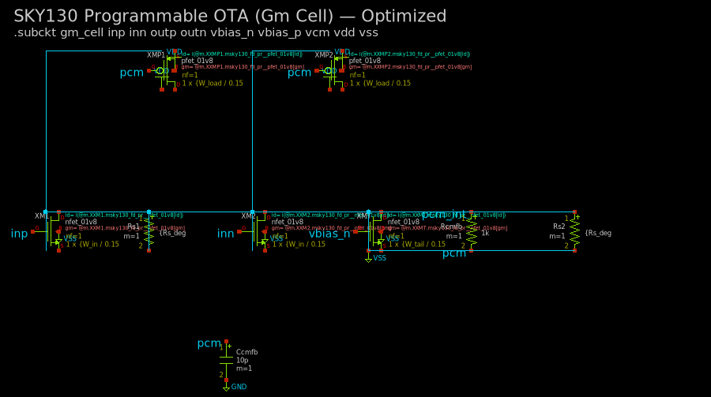
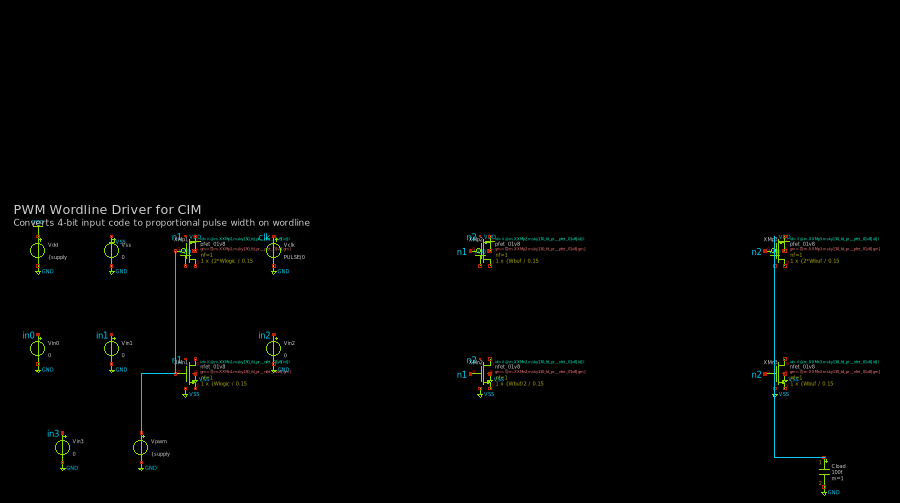
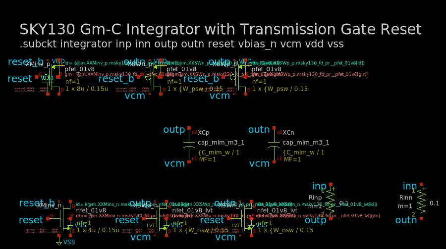
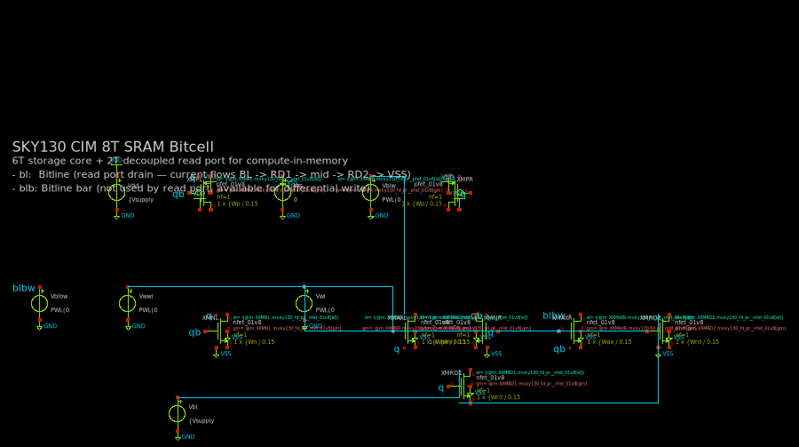
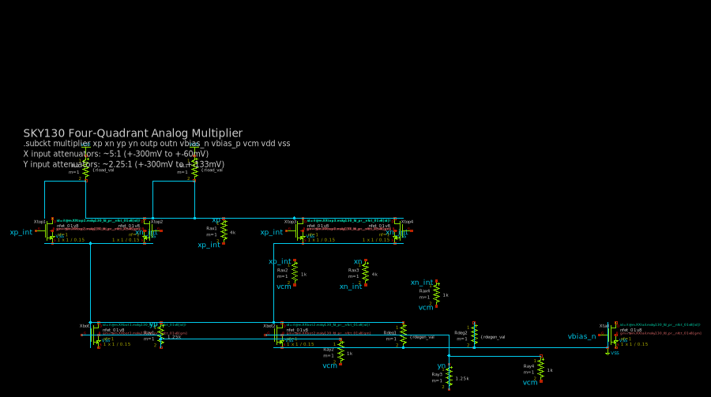
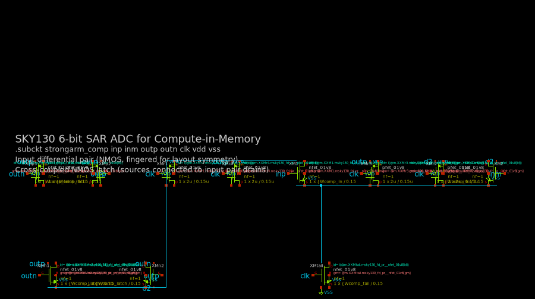
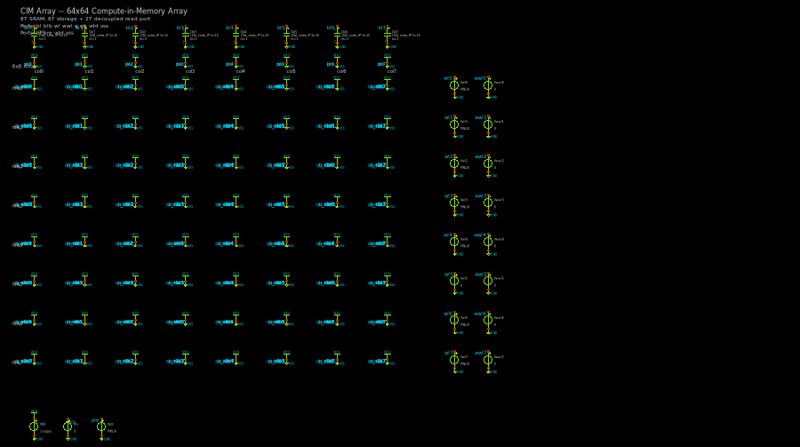

# cir2sch — SPICE Netlist to Schematic Converter

Converts `.cir` SPICE netlists into xschem `.sch` schematics with intelligent placement and routing.

## Current Aggregate Score: 5.1/10

| Circuit | Clarity | Wires | Hierarchy | Spacing | Presentation | Avg | Crossings |
|---------|---------|-------|-----------|---------|-------------|-----|-----------|
| ode_gm-cell | 8 | 8 | 7 | 7 | 7 | **7.4** | 0 |
| cim_pwm-driver | 6 | 7 | 7 | 5 | 5 | **6.0** | 0 |
| ode_integrator | 5 | 7 | 5 | 5 | 5 | **5.4** | 0 |
| cim_bitcell | 5 | 5 | 5 | 5 | 4 | **4.8** | 0 |
| ode_multiplier | 5 | 5 | 5 | 4 | 4 | **4.6** | 3 |
| cim_adc | 4 | 6 | 4 | 4 | 3 | **4.2** | 0 |
| cim_array | 3 | 5 | 3 | 3 | 2 | **3.2** | 0 |

**Total wire crossings: 3** (down from 28 baseline)

## Renders

### ode_gm-cell — Programmable OTA (7.4/10)


### cim_pwm-driver — PWM Wordline Driver (6.0/10)


### ode_integrator — Gm-C Integrator (5.4/10)


### cim_bitcell — 8T SRAM Bitcell (4.8/10)


### ode_multiplier — Four-Quadrant Multiplier (4.6/10)


### cim_adc — 6-bit SAR ADC / StrongARM Comparator (4.2/10)


### cim_array — 8x8 CIM Array (3.2/10)


## Pipeline

```
parser.py → placer.py → router.py → renderer.py
```

### Key Features
- **Building block detection**: Diff pairs, current mirrors, cross-coupled pairs, CMOS inverters
- **Hierarchical placement**: PMOS top, NMOS bottom, signal flows left-to-right
- **Connected block stacking**: Groups related blocks vertically (e.g., Gilbert cell top quad above bottom pair)
- **Smart passive placement**: Supply-connected, inline, and input passives categorized and placed appropriately
- **Crossing-aware routing**: Chooses L-route direction to minimize wire crossings
- **MST-based chain routing**: Minimum spanning tree for multi-pin net connections
- **Array detection**: Regular grid patterns (e.g., bitcell arrays) placed as 2D grids
- **Subcircuit-aware parsing**: Auto-selects largest subcircuit when top-level is testbench

## What Still Needs Work
- cim_array: Subcircuit instances too small to read, no row/column annotations
- cim_adc: PMOS reset devices spread too wide, needs tighter comparator layout
- ode_multiplier: Input attenuator resistors could be more compact
- General: Component property text overlaps in dense areas
